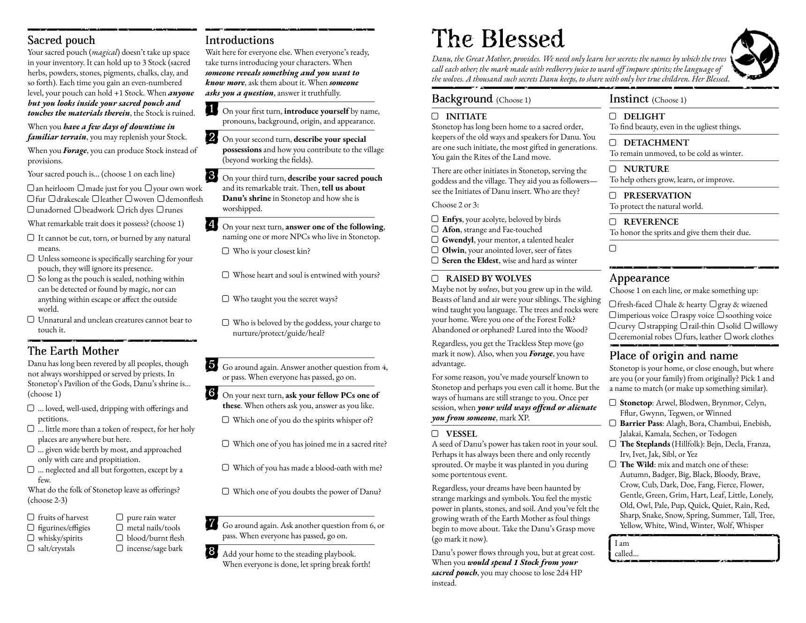
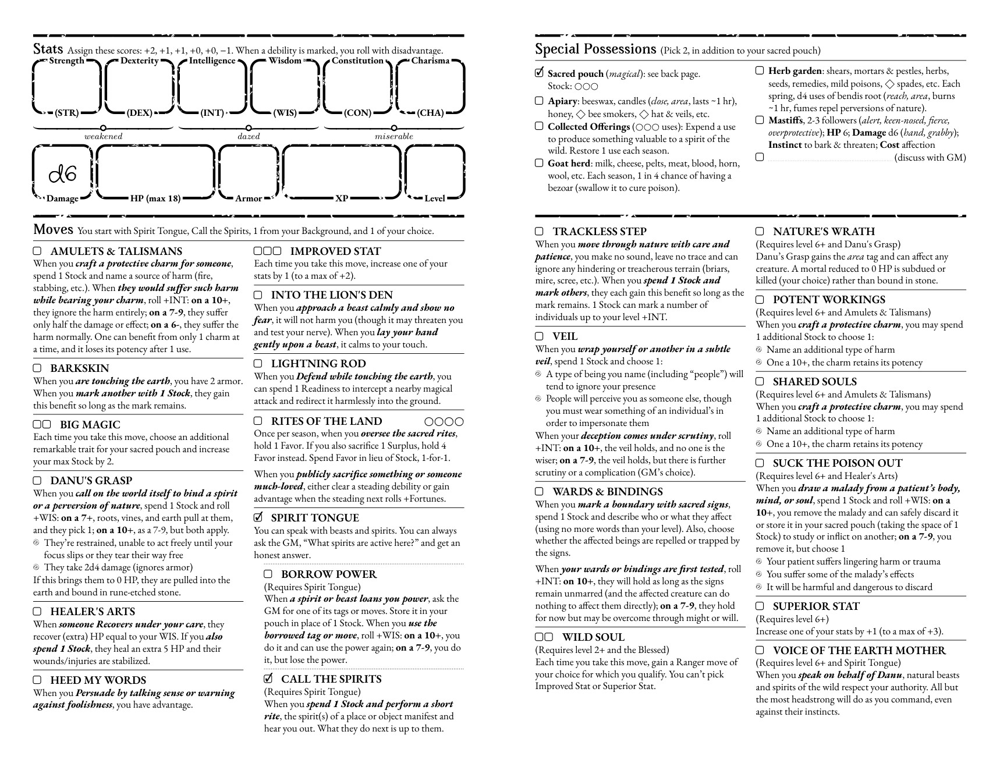

# Stonetop Playbook Typst Template
A Typst template for making custom playbooks for the tabletop roleplaying game *Stonetop*.

This work contains text adapted from [*Book 1 Stonetop*](https://plusoneexp.com/collections/stonetop) pp. 105-108 by Jeremy Strandburg, licensed under [CC BY 4.0](https://creativecommons.org/licenses/by/4.0/).

For simplicity's sake, the rest of this work is licensed under the same license, except `img/grunge.svg`, which is in the public domain.


## Usage
Download [typst](https://github.com/typst/typst) and add the executable to your PATH.

Change the first line of `playbook.typ` to point at your playbook data file and then run `typst playbook.typ` in your terminal.

```typst
#import "playbook_data_blessed.typ": *
```

See `playbook_data_blessed.typ` for how to format the data file.

Useful shortcuts for writing playbooks are located in `playbook_lib.typ`.


## Fonts
By default, these are the fonts used in this template:
- [EB Garamond](https://fonts.google.com/specimen/EB+Garamond) instead of "Adobe Caslon Pro" (as in the official playbooks) for paragraph font. You can change it to look more official if you own Adobe Caslon Pro.
- [Avara](https://velvetyne.fr/download/?font=avara) for headings
- [Crafty Girls](https://fonts.google.com/specimen/Crafty+Girls) for handwriting


## Screenshots


